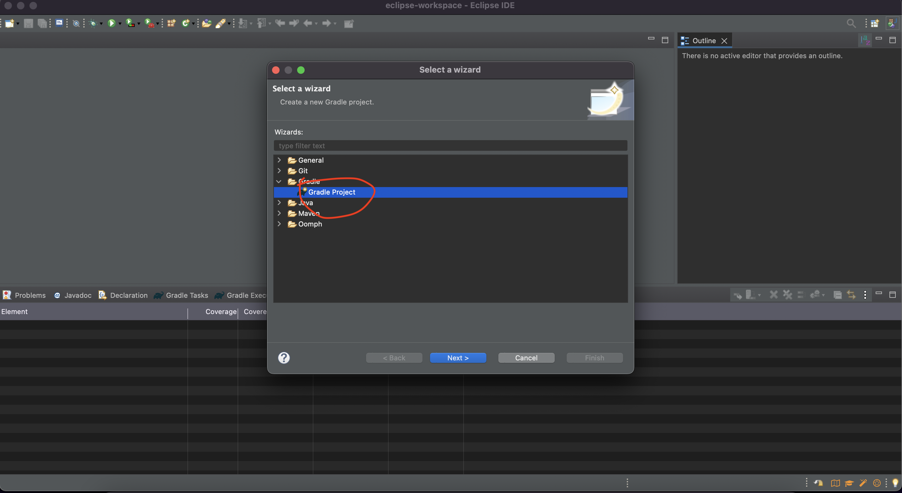

UnB - Universidade de Brasilia  
FGA - Faculdade do Gama  
TPPE - Técnicas de Programação para Plataformas Emergentes  

## Integrantes do grupo

| Nome | Matrícula |
|--- |--- |
| Amanda | 19/0124997 |
| Irwin Schmitt | 17/0105342 |
| Sara Campos | 17/0045269 |
| Thaís Rebouças | 18/0078224 |
| Victor Yukio | 18/0068229 |

## Trabalho Prático 1 - _Test-Driven Development_

**Enunciado** 

Seja o cenário descrito a seguir: 

> Cálculo da completude de informações estruturadas, aninhadas ou não: 
> 
> Um sistema de informações deve, dentre várias outras atribuições, calcular o
> quão completa é uma informação que ele processa baseado em um modelo
> descritivo das informações sob análise. As informações são sempre tratadas
> como valores textuais, independentemente se o valor é de fato um texto ou não.
> Avaliar a completude, nesse caso, significa verificar a presença ou ausência
> de algum valor para o campo correspondente. 
> 
> Um registro, i.e. um conjunto de informações científicas agregadas, é composto
> de vários campos, podendo cada um desses campos serem atômicos ou compostos em
> vários níveis. Exemplos: 
> * Atômico: CPF
> * Atômico: Matricula
> * Atômico: Sexo 
> * Atômico: Email
> * Composto: Nome
>   * Atômico: PrimeiroNome
>   * Atômico: NomeMeio
>   * Atômico: UltimoNome
> 
> Os campos podem ser agrupados para criar novos campos formando uma árvore de
> campos para os registros. Essa árvore deve respeitar o modelo de dados sob
> análise. Exemplo:
> * Composto: PessoaFisica
>   * Composto: Nome
>     * Atômico: PrimeiroNome
>     * Atômico: NomeMeio
>     * Atômico: UltimoNome
>   * Atômico: CPF
>   * Atômico: Matricula
>   * Atômico: Sexo 
>   * Atômico: Email
> 
> Os campos aninhados podem ser agrupados seguindo duas regras lógicas bem
> conhecidas. A regra OU EXCLUSIVO estabelece que o campo raiz é considerado
> completo quando apenas um dos campos filhos está presente, qualquer um dos
> campos filhos agregados. A regra OU INCLUSIVO estabelece que o campo raiz é
> considerado preenchido quando pelo menos um campo filho está presente. O caso
> especial em que nenhum campo filho está presente é considerado como
> não-preenchido. Para o campo raiz ser considerado completo, todos os campos
> filhos devem estar presente. 
> 
> Para o caso de campo atômico, ele é considerado completo se há um valor
> atribuído a ele. 
> 
> O cálculo da completude de um registro é feito de maneira recursiva, de modo
> que o valor da completudo do campo pai de um registro é dado pelo valor da
> completude de seus filhos, considerando as regras apresentadas anteriormente. 
>
>O trabalho deverá apresentar o emprego das três técnicas de TDD (falsificação,
duplicação e triangulação) em, pelo menos, nas três seguintes situações: 
>
> * Calculo da completude de campos OR EXCLUSIVO; 
> * Cálculo da completude de registros multi-campos.
>
> Nesses dois casos deverá, para efeito de evidência, ter a seguinte sequencia de
_commits_:
> * falsificação; 
> * duplicação; 
> * triangulação.
---

## Screenshots
Adicione 3 ou mais screenshots do projeto em funcionamento.

## Instalação 
**Linguagem**: Java (gradle) JDK 17

### Eclipse

Siga os passos:





### vsCode

Siga os passos:

1) Verifique se o gradle na versão 8.1.1 está instalado na sua máquina.

2) Vá para a pasta do projeto (T1-Project) e digite os comandos no terminal:

```console
 $ gradle build
 $ gradle test
```

### Intellij

Siga os passos:

1) Abra o projeto com a opção de gradle e java.

2) Execute o passo:


## Rodando


